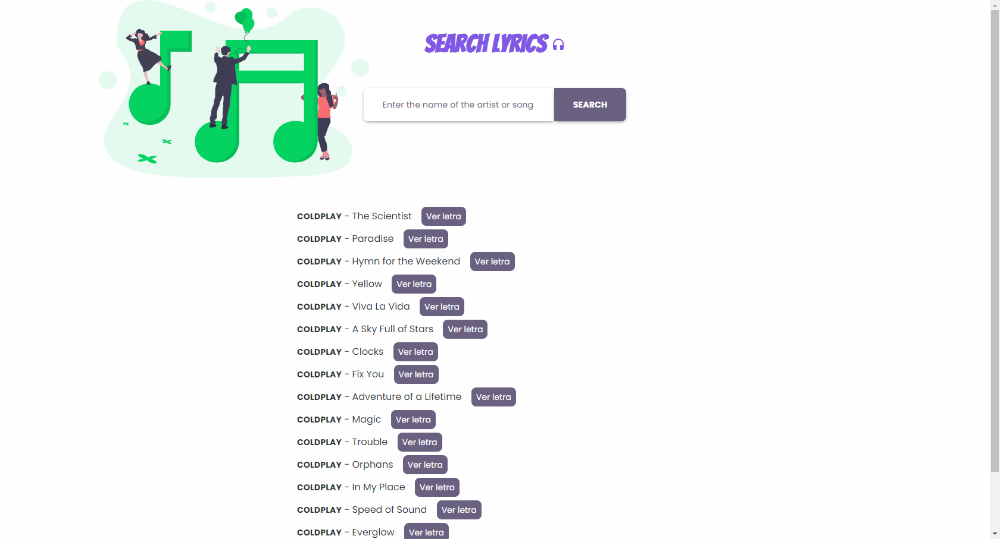
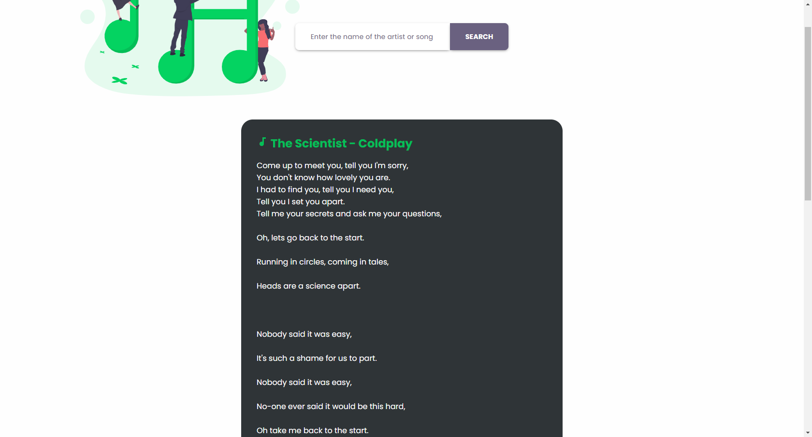

<h1 align="center">
    
</h1>

<h1 align="center">
    <a href="https://leonardocampello-dev.github.io/Search-lyrics-app/">Search Lyrics 🎶</a>
</h1>

## 📑 Description 

Search Lyrics is an application that finds lyrics for your favorite songs

## ⚙ API used 

- [x] [lyrics.ovh](https://lyricsovh.docs.apiary.io/#reference/0/lyrics-of-a-song/search)

## 🎥 Demonstration 

**Home** 🏡

**Lyrics** 🎸 

